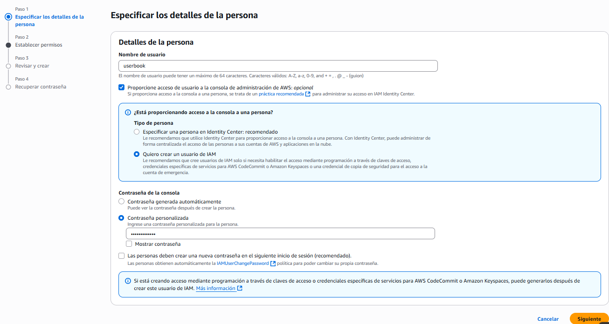
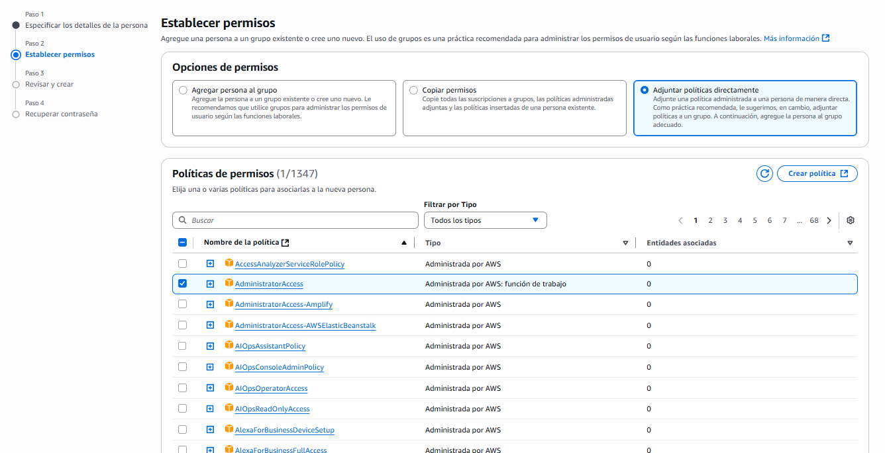
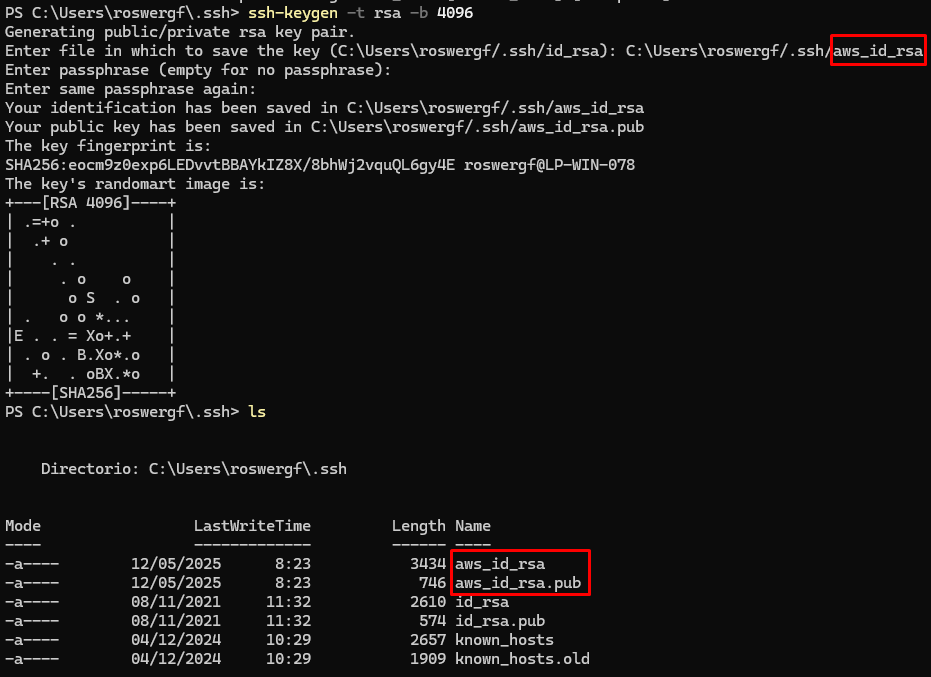

# Deployment of the app on AWS 🚀

The project has the necessary configurations to be deployed on AWS. For this purpose, **Docker** and **Docker Compose** are used.

It has a `docker-compose-deploy.yml` file that allows to deploy the application in a production environment. It is in charge of creating and deploying the necessary containers for the application, which are:

- **app**: Main container of the application.
- **db**: Database container.
- **proxy**: Nginx container that acts as a reverse proxy for the application.

---

### Table of Contents

- [Project Structure](#project-structure)
- [Pre-visualization of the application in DEBUG mode with Docker](#pre-visualization-of-the-application-in-debug-mode-with-docker)
    - [Docker installation](#docker-installation)
    - [Cleaning of containers and images](#cleaning-of-containers-and-images)
- [Create AWS Account](#create-aws-account)
- [Create IAM user](#create-iam-user)
- [Upload SSH Key to AWS (Windows)](#upload-ssh-key-to-aws-windows)
- [Create an EC2 instance](#create-an-ec2-instance)
- [GitHub deploy key setup (Optional)](#github-deploy-key-setup-optional)
- [Installing Docker, Docker Compose and Git on the EC2 Instance](#installing-docker-docker-compose-and-git-on-the-ec2-instance)
- [Clone the repository to the EC2 instance](#clone-the-repository-to-the-ec2-instance)
- [Deploy the application to the EC2 instance.](#deploy-the-application-to-the-ec2-instance)
- [Access the application](#access-the-application)

---

## Project Structure

```
app
|___ app/ (Django Backend settings)
|   |___ app/
|   |    |___ settings.py
|   |    |___ wsgi.py
|   |___ manage.py
|___ proxy/ (Nginx configuration)
docker-compose.yml
docker-compose-deploy.yml
requirements.txt
```

## Pre-visualization of the application in DEBUG mode with Docker

### Docker installation

- If you do not have Docker installed, you can follow the [official installation guide](https://docs.docker.com/get-docker/) for your operating system.

- To confirm that Docker is installed correctly, run the following command in your terminal on the project path:

   ```bash
    docker-compose --version
   ```

- To run the application in development mode, use the following command:

    ```bash
    docker-compose up --build
    ```

- Navigate to `http://localhost:8000/api/docs/` to check that the application is running correctly.

### Cleaning of containers and images

To check that the application in production mode works correctly on your local machine, you can use the `docker-compose-deploy.yml` file to deploy the application in a production environment. To do this, follow the steps below:

- Create a `.env` file in the root of the project with the following variables:

    ```bash
    DB_NAME=dbname
    DB_USER=rootuser
    DB_PASS=changeme
    DB_ROOT_PASS=changeme
    DJANGO_SECRET_KEY=changeme
    DJANGO_ALLOWED_HOSTS=127.0.0.1
    ```

- Use Docker Compose to raise the containers:

    ```bash
    docker-compose -f docker-compose-deploy.yml up --build
    ```
- Open your browser and access `http://localhost/api/docs/` to check that the application is working properly.

- To stop the containers, use `<Ctrl> + C` twice in the terminal where Docker Compose is running and then to download the containers use the command:

    ```bash
    docker-compose -f docker-compose-deploy.yml down
    ```

---

## Create AWS Account

You need to create an AWS account in order to deploy the application. You can sign up at [AWS](https://repost.aws/es/knowledge-center/create-and-activate-aws-account) and follow the instructions to create a free account.

---

## Create IAM user
- Log in to the AWS console and go to the IAM (Identity and Access Management) service.
- Select “Users” from the side menu and click “Add user”.


- In step 1, assign a username and select “Provide user access to AWS Management Console” and “I want to create an IAM user”, then set the login password and click “Next”.



- In step 2, select “Attach existing policies directly” and search for “AdministratorAccess”. Select the policy and click “Next”.



- In step 3, review the settings and click “Create User”.
- In step 4, a summary of the user creation will be displayed. Be sure to save the login details, as you will need them to connect to AWS from your local machine.

---

## Upload SSH Key to AWS (Windows)

- Open the Windows terminal (CMD or PowerShell) and navigate to the folder where you have the SSH key you want to upload (e.g. `C:\Users YourUser.ssh\`).
- Run the following command to create an SSH key pair:

    ```bash
    ssh-keygen -t rsa -b 4096
    ```
- You will be prompted to enter a key name and password. You can leave it blank if you do not want to set a password.



- Once the key is generated, you will see two files: `id_rsa` (private key) and `id_rsa.pub` (public key).
- Open the `id_rsa.pub` file with a text editor or use the following command to display its contents in the terminal and copy it:

    ```bash
    cat id_rsa.pub
    ```
- Access the `AWS` console and go to the `EC2` service.
- Select ``Key Pairs`` from the side menu and click ``Import Key Pair``.
- Assign a name to the key and paste the contents of the public key you copied earlier into the corresponding field. Then click on “Import Key Pair”.

---

## Create an EC2 instance

- In the `AWS` console, go to the `EC2` service.
- Click “Launch Instance” to create a new instance.
- Select an Amazon Machine Image (AMI) of your choice. For example, you can choose the Amazon Linux 3 2023 AMI.
- Select the instance type (for example, `t3.micro` for the free layer).
- Under Key pair, select the SSH key you imported earlier in [previous bullet](#load-from-ssh-key-on-aws-windows).
- In the Network Settings section, make sure that the “Allow HTTP traffic” option is enabled to allow access to the application from outside.
- In this same section, select “Allow HTTP traffic from the Internet”.
- Finally, click on “Launch Instance” to create the instance.


- Go to the “Instances” section in the side menu and select the instance you just created.
- Copy the public IP address of the instance, which you will need to connect to it later.
- Open the Windows terminal (CMD or PowerShell) and navigate to the folder where you have the SSH key you [imported earlier](#load-from-ssh-key-in-aws-windows).
- Connect to the instance using the following command, replacing `ec2-user` with the username of your AMI and `IP_PUBLIC` with the public IP address of your instance:

    ```bash
    ssh -i “id_rsa” ec2-user@IP_PUBLICA
    ```
- If this is the first time you are connecting to the instance, you will be prompted to confirm the connection. Type “yes" and press Enter.

---

## GitHub deploy key setup (Optional)

If you want to use an SSH key to authenticate to GitHub from your EC2 instance by logging in as above, you can follow these steps:

- Generate a new SSH key on your EC2 instance using the following command:

    ```bash
    ssh-keygen -t ed25519 -b 4096
    ```
- You will be prompted to enter a key name and password. You can leave it blank if you do not wish to set a password.
- Once the key is generated, you will see two files: `id_ed25519` (private key) and `id_ed25519.pub` (public key).
- Open the `id_ed25519.pub` file with a text editor or use the following command to display its contents in the terminal and copy it:

    ```bash
    cat ~/.ssh/id_ed25519.pub
    ```

- Log in to your GitHub account and go to the “Settings” section of your repository and select “Deploy keys” from the side menu.
- Click “Add deploy key” and paste the content of the public key you copied earlier into the corresponding field. Then click “Add key”.

---

## Installing Docker, Docker Compose and Git on the EC2 Instance
- Once connected to the EC2 instance, update the system packages using the following command:
    - To install Git:
        ```bash
        sudo yum install git -y
        ```
    - To install Docker:
        ```bash
        sudo yum install docker -y
        ```
    - To enable the Docker service:
        ```bash
        sudo systemctl start docker
        sudo systemctl enable docker
        ```
    - To use Docker without sudo:
        ```bash
        sudo usermod -aG docker ec2-user
        ```
    - To install Docker Compose:
        ```bash
        mkdir -p ~/.docker/cli-plugins/
        ```
        ```bash
        curl -SL https://github.com/docker/compose/releases/latest/download/docker-compose-linux-x86_64 -o ~/.docker/cli-plugins/docker-compose
        ```
        ```bash
        chmod +x ~/.docker/cli-plugins/docker-compose
        ```

---

## Clone the repository to the EC2 instance

- Once you have installed Docker and Docker Compose, you can clone your application repository into the EC2 instance using the following command:

    ```bash
    git clone git@github.com:username/repository.git
    ```

- Enter the project folder:

    ```bash
    cd repository
    ```
- Copy the `.env.example` file to `.env` and edit it with the corresponding values:

    ```bash
    cp .env.example .env
    nano .env
    ```

Note: The `DJANGO_ALLOWED_HOSTS` field must contain the public IP address of your EC2 instance with the name “Public IPv4 DNS” that appears in the AWS console.

---

## Deploy the application to the EC2 instance.

- Make sure that the `docker-compose-deploy.yml` file is in the root of the project.
- Run the following command to deploy the application in production mode:

    ```bash
    docker compose -f docker-compose-deploy.yml up -d
    ```
- Open your browser and access `http://IP_PUBLICA/api/docs/` to check that the application is working properly.
- To login to Django Admin, access `http://IP_PUBLICA/admin/` and use the superuser credentials, to generate it you can use the following command:

    ```bash
    docker compose -f docker-compose-deploy.yml run -rm app sh -c “python manage.py createsuperuser”
    ```

## Access the application
- Open your browser and access `http://IP_PUBLICA/api/docs/` to check that the application is working properly.

---

[Spanish version](deploy-doc-es.md)
