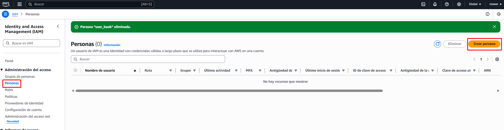
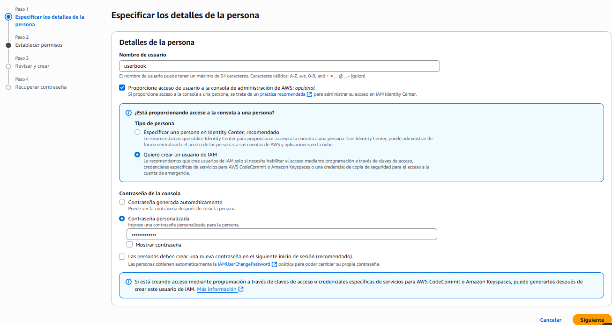
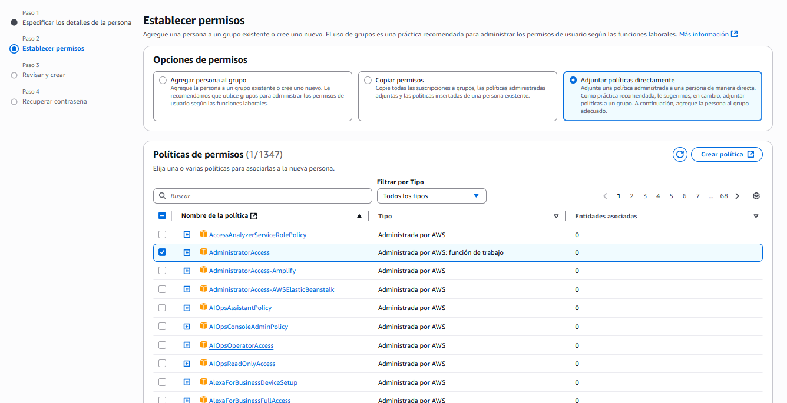
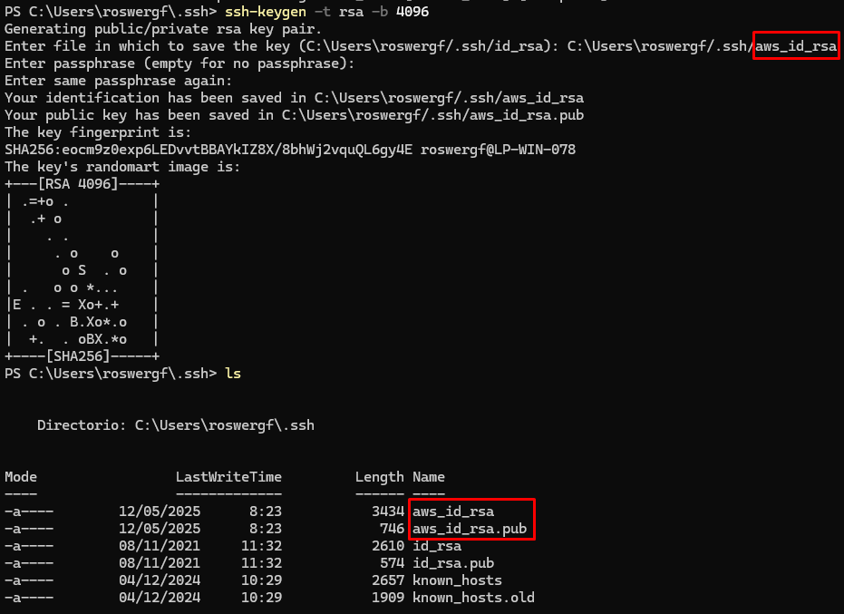
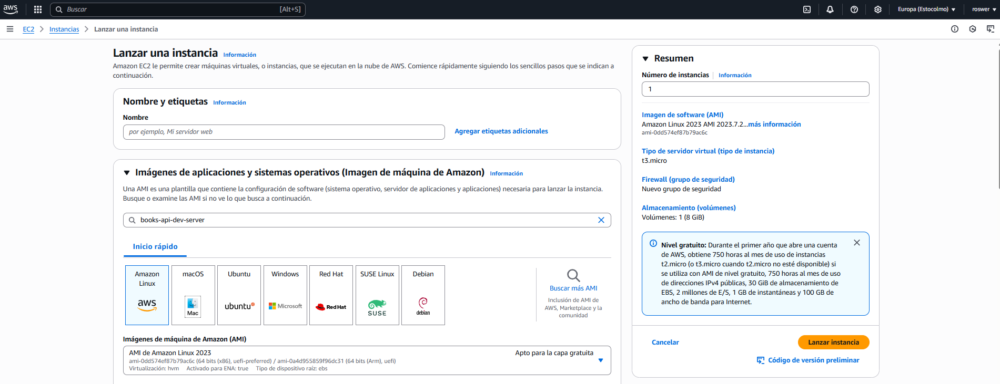

# Despliegue de la app en AWS 🚀

El proyecto posee las configuraciones necesarias para ser desplegado en AWS. Para ello, se utiliza **Docker** y **Docker Compose**.

Dispone de un archivo `docker-compose-deploy.yml` que permite levantar la aplicación en un entorno de producción. El cual se encarga de crear y levantar los contenedores necesarios para la aplicación los cuales son:

- **app**: Contenedor principal de la aplicación.
- **db**: Contenedor de la base de datos.
- **proxy**: Contenedor de Nginx que actúa como proxy inverso para la aplicación.

---

### Tabla de contenidos

- [Estructura del proyecto](#estructura-del-proyecto)
- [Pre-visualización de la aplicación modo DEBUG con Docker](#pre-visualización-de-la-aplicación-modo-debug-con-docker)
  - [Instalación de Docker](#intalación-de-docker)
  - [Limpieza de contenedores e imágenes](#limpieza-de-contenedores-e-imágenes)
- [Pre-visualización de la aplicación en modo producción](#pre-visualización-de-la-aplicación-en-modo-producción)
- [Crear cuenta en AWS](#crear-cuenta-en-aws)
- [Crear usuario IAM](#crear-usuario-iam)
- [Cargar de SSH Key en AWS (Windows)](#cargar-de-ssh-key-en-aws-windows)
- [Crear una instancia EC2](#crear-una-instancia-ec2)
- [Configuración GitHub deploy key (Opcional)](#congiguración-github-deploy-key-opcional)
- [Instalación de Docker, Docker Compose y Git en la instancia EC2](#instalación-de-docker-docker-compose-y-git-en-la-instancia-ec2)
- [Clonar el repositorio en la instancia EC2](#clonar-el-repositorio-en-la-instancia-ec2)
- [Desplegar la aplicación en la instancia EC2](#desplegar-la-aplicación-en-la-instancia-ec2)
- [Acceder a la aplicación](#acceder-a-la-aplicación)

---

## Estructura del proyecto
```
app
|___ app/ (Django Backend settings)
|   |___ app/
|   |    |___ settings.py
|   |    |___ wsgi.py
|   |___ manage.py
|___ proxy/ (Nginx configuration)
docker-compose.yml
docker-compose-deploy.yml
requirements.txt
```

## Pre-visualización de la aplicación modo DEBUG con Docker

### Intalación de Docker

- Si no tienes Docker instalado, puedes seguir la [guía oficial de instalación](https://docs.docker.com/get-docker/) para tu sistema operativo.

- Para confirmar que Docker está instalado correctamente, ejecuta el siguiente comando en tu terminal sobre la ruta del proyecto:

   ```bash
    docker-compose --version
   ```

- Para ejecutar la aplicación en modo desarrollo, utiliza el siguiente comando:

    ```bash
    docker-compose up --build
    ```

- Navega a `http://localhost:8000/api/docs/` para comprobar que la aplicación está funcionando correctamente.

---

### Limpieza de contenedores e imágenes

- Si deseas detener los contenedores, usa `<Ctrl> + C` dos veces en la terminal donde se está ejecutando Docker Compose.
- Para bajar los contenedores usa el comando:

    ```bash
    docker-compose down
    ```

---

## Pre-visualización de la aplicación en modo producción

Para comprobar que la aplicación en modo producción funciona correctamente en tu equipo local, puedes utilizar el archivo `docker-compose-deploy.yml` para levantar la aplicación en un entorno de producción. Para ello, sigue los siguientes pasos:

- Crea un archivo `.env` en la raíz del proyecto con las siguientes variables:

    ```bash
    DB_NAME=dbname
    DB_USER=rootuser
    DB_PASS=changeme
    DB_ROOT_PASS=changeme
    DJANGO_SECRET_KEY=changeme
    DJANGO_ALLOWED_HOSTS=127.0.0.1
    ```

- Utiliza Docker Compose para levantar los contenedores:

    ```bash
    docker-compose -f docker-compose-deploy.yml up --build
    ```

- Abre tu navegador y accede a `http://localhost/api/docs/` para comprobar que la aplicación está funcionando correctamente.

- Para detener los contenedores, usa `<Ctrl> + C` dos veces en la terminal donde se está ejecutando Docker Compose y luego para bajar los contenedores usa el comando:

    ```bash
    docker-compose -f docker-compose-deploy.yml down
    ```

---

## Crear cuenta en AWS

Es necesario crear una cuenta en AWS para poder desplegar la aplicación. Puedes registrarte en [AWS](https://repost.aws/es/knowledge-center/create-and-activate-aws-account) y seguir las instrucciones para crear una cuenta gratuita.

---

## Crear usuario IAM
- Accede a la consola de AWS y dirígete al servicio IAM (Identity and Access Management).
- Selecciona "Users" en el menú lateral y haz clic en "Add user".



- En el paso 1, asigna un nombre de usuario y selecciona "Proporcionar acceso al usuario a la consola de administración de AWS" y "Quiero crear un usuario de IAM", luego establece la contraseña de acceso y haz clic en "Siguiente".



- En el paso 2, selecciona "Adjuntar políticas existentes directamente" y busca "AdministratorAccess". Selecciona la política y haz clic en "Siguiente".



- En el paso 3, revisa la configuración y haz clic en "Crear usuario".
- En el paso 4, se mostrará un resumen de la creación del usuario. Asegúrate de guardar los datos de acceso, ya que los necesitarás para conectarte a AWS desde tu máquina local.

---

## Cargar de SSH Key en AWS (Windows)

- Abre la terminal de Windows (CMD o PowerShell) y navega a la carpeta donde tienes la clave SSH que deseas cargar (por ejemplo, `C:\Users\TuUsuario\.ssh\`).
- Ejecuta el siguiente comando para crear un par de claves SSH:

    ```bash
    ssh-keygen -t rsa -b 4096
    ```
- Se te pedirá que ingreses un nombre para la clave y una contraseña. Puedes dejarlo en blanco si no deseas establecer una contraseña.



- Una vez generada la clave, verás dos archivos: `id_rsa` (clave privada) y `id_rsa.pub` (clave pública).
- Abre el archivo `id_rsa.pub` con un editor de texto o usa el siguiente comando para mostrar su contenido en la terminal y cópialo:

    ```bash
    cat id_rsa.pub
    ```
- Accede a la consola de `AWS` y dirígete al servicio `EC2`.
- Selecciona "Key Pairs" en el menú lateral y haz clic en "Import Key Pair".
- Asigna un nombre a la clave y pega el contenido de la clave pública que copiaste anteriormente en el campo correspondiente. Luego, haz clic en "Import Key Pair".

---

## Crear una instancia EC2

- En la consola de `AWS`, dirígete al servicio `EC2`.
- Haz clic en "Launch Instance" para crear una nueva instancia.
- Selecciona una Amazon Machine Image (AMI) de tu preferencia. Por ejemplo, puedes elegir la AMI de Amazon Linux 3 2023.
- Selecciona el tipo de instancia (por ejemplo, `t3.micro` para la capa gratuita).
- En Par de claves, selecciona la clave SSH que importaste anteriormente en el [punto anterior](#cargar-de-ssh-key-en-aws-windows).
- En la sección de configuración de red, asegúrate de que la opción "Permitir tráfico HTTP" esté habilitada para permitir el acceso a la aplicación desde el exterior.
- En esta misma sección, selecciona "Permitir tráfico HTTP desde Internet".
- Por último, haz clic en "Launch Instance" para crear la instancia.



- Dirigete a la sección "Instances" en el menú lateral y selecciona la instancia que acabas de crear.
- Copia la dirección IP pública de la instancia, que necesitarás para conectarte a ella más adelante.
- Abre la terminal de Windows (CMD o PowerShell) y navega a la carpeta donde tienes la clave SSH que [importaste anteriormente](#cargar-de-ssh-key-en-aws-windows).
- Conéctate a la instancia utilizando el siguiente comando, reemplazando `ec2-user` por el nombre de usuario de tu AMI y `IP_PUBLICA` por la dirección IP pública de tu instancia:

    ```bash
    ssh -i "id_rsa" ec2-user@IP_PUBLICA
    ```
- Si es la primera vez que te conectas a la instancia, se te pedirá que confirmes la conexión. Escribe "yes" y presiona Enter.

---

## Congiguración GitHub deploy key (Opcional)

Si deseas utilizar una clave SSH para autenticarte en GitHub desde tu instancia EC2 ingresando como indica el punto anterior, puedes seguir estos pasos:

- Genera una nueva clave SSH en tu instancia EC2 utilizando el siguiente comando:

    ```bash
    ssh-keygen -t ed25519 -b 4096
    ```
- Se te pedirá que ingreses un nombre para la clave y una contraseña. Puedes dejarlo en blanco si no deseas establecer una contraseña.
- Una vez generada la clave, verás dos archivos: `id_ed25519` (clave privada) y `id_ed25519.pub` (clave pública).
- Abre el archivo `id_ed25519.pub` con un editor de texto o usa el siguiente comando para mostrar su contenido en la terminal y cópialo:

    ```bash
    cat ~/.ssh/id_ed25519.pub
    ```

- Accede a tu cuenta de GitHub y dirígete a la sección "Settings" de tu repositorio y selecciona "Deploy keys" en el menú lateral.
- Haz clic en "Add deploy key" y pega el contenido de la clave pública que copiaste anteriormente en el campo correspondiente. Luego, haz clic en "Add key".

---

## Instalación de Docker, Docker Compose y Git en la instancia EC2
- Una vez conectado a la instancia EC2, actualiza los paquetes del sistema utilizando el siguiente comando:
    - Para instalar Git:
        ```bash
        sudo yum install git -y
        ```
    - Para instalar Docker:
        ```bash
        sudo yum install docker -y
        ```
    - Para habilitar el servicio de Docker:
        ```bash
        sudo systemctl start docker
        sudo systemctl enable docker
        ```
    - Para usar Docker sin sudo:
        ```bash
        sudo usermod -aG docker ec2-user
        ```
    - Para instalar Docker Compose:
        ```bash
        mkdir -p ~/.docker/cli-plugins/
        ```
        ```bash
        curl -SL https://github.com/docker/compose/releases/latest/download/docker-compose-linux-x86_64 -o ~/.docker/cli-plugins/docker-compose
        ```
        ```bash
        chmod +x ~/.docker/cli-plugins/docker-compose
        ```

---

## Clonar el repositorio en la instancia EC2

- Una vez que hayas instalado Docker y Docker Compose, puedes clonar el repositorio de tu aplicación en la instancia EC2 utilizando el siguiente comando:

    ```bash
    git clone git@github.com:username/repository.git
    ```

- Ingresa a la carpeta del proyecto:

    ```bash
    cd repository
    ```
- Copia el archivo `.env.example` a `.env` y edítalo con los valores correspondientes:

    ```bash
    cp .env.example .env
    nano .env
    ```

Nota: El campo `DJANGO_ALLOWED_HOSTS` debe contener la dirección IP pública de tu instancia EC2 con el nombre de "Public IPv4 DNS" que aparece en la consola de AWS.

---

## Desplegar la aplicación en la instancia EC2

- Asegúrate de que el archivo `docker-compose-deploy.yml` esté en la raíz del proyecto.
- Ejecuta el siguiente comando para levantar la aplicación en modo producción:

    ```bash
    docker compose -f docker-compose-deploy.yml up -d
    ```
- Abre tu navegador y accede a `http://IP_PUBLICA/api/docs/` para comprobar que la aplicación está funcionando correctamente.
- Para ingresar a Django Admin, accede a `http://IP_PUBLICA/admin/` y utiliza las credenciales de superusuario, para generarlo puedes usar el siguiente comando:

    ```bash
    docker compose -f docker-compose-deploy.yml run -rm app sh -c "python manage.py createsuperuser"
    ```

## Acceder a la aplicación
- Abre tu navegador y accede a `http://IP_PUBLICA/api/docs/` para comprobar que la aplicación está funcionando correctamente.

---

[Version en inglés](deploy-doc-en.md)